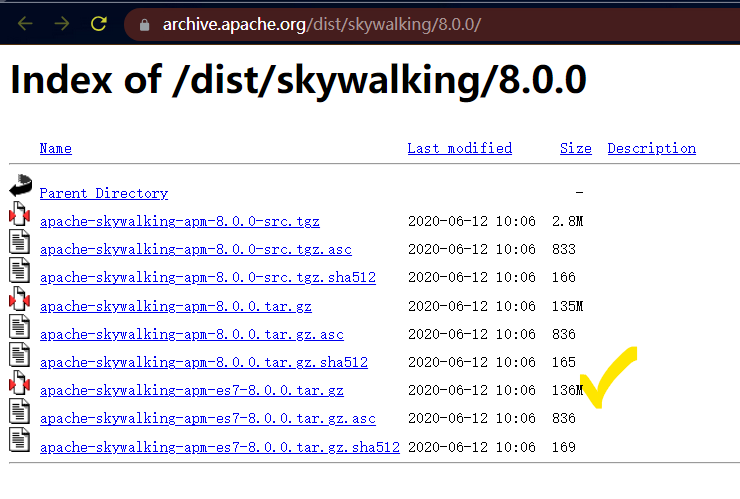
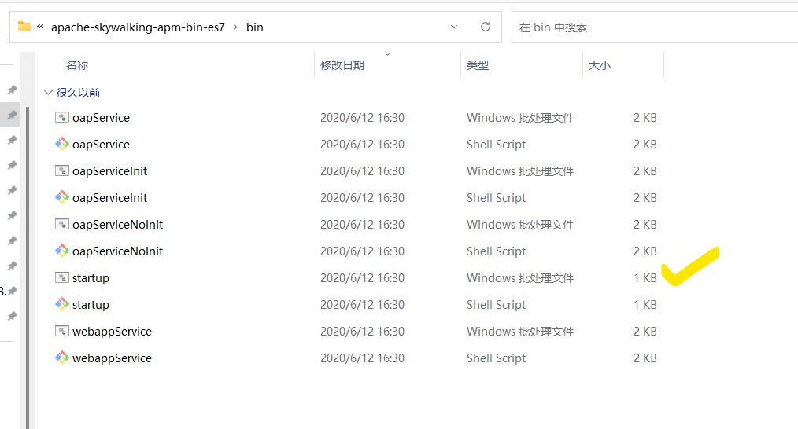
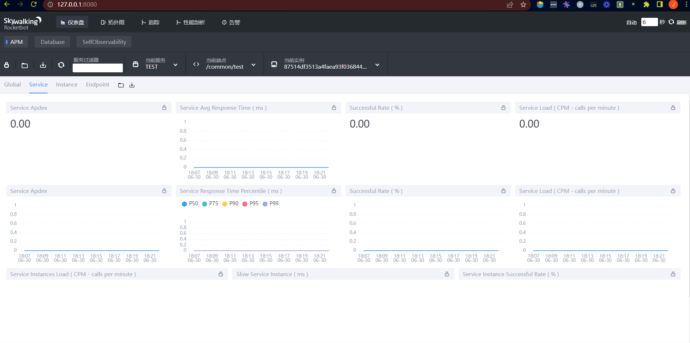
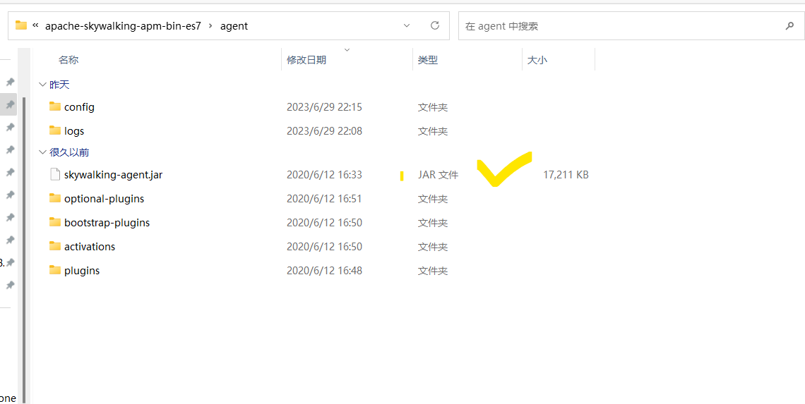
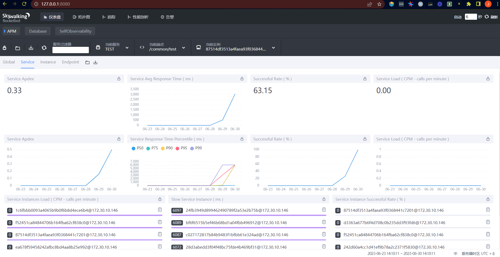

# skyalking-demo

## 环境

- JDK 8
- apache-skywalking-apm-es7-8.0.0
- windows

## v1.0.0 项目搭建

- 使用 apm(默认 h2 内存数据库) + spring-boot + agent 搭建 skyalking 测试环境。

### apm 搭建(使用默认的 h2 内存数据库)

#### apache-skywalking-apm-es7-8.0.0.tar.gz 下载

- https://skywalking.apache.org/downloads/#SkyWalkingAPM
- https://archive.apache.org/dist/skywalking/8.0.0/



### 解压并到 bin 目录下启动

- 解压，点击startup.bat



- 在浏览器里输入：http://localhost:8080/



### agent 使用

#### 构建一个简单的 spring-boot web 服务

- 源码参考：https://github.com/GHQiuJun/skyalking-demo

#### 配置 Java 程序启动参数

- agent 包位于解压缩包 agent 目录下



- IDE 点击run-->Edit Configurations-->Add VM options 添加如下参数

```
-javaagent:XXXXX\skywalking-agent.jar // agent 路径
-Dskywalking.agent.service_name=TEST
-Dskywalking.collector.backend_service=127.0.0.1:11800
```

### 启动应用 & 发送请求测试



## Tips

- 部分 apache-skywalking-apm 版本和 JDK 版本存在兼容性问题

